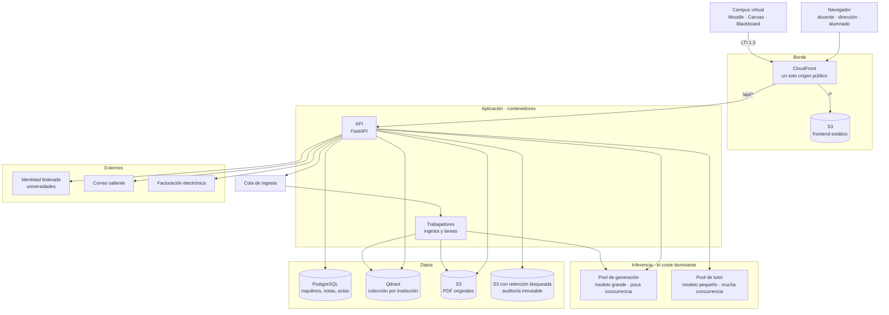

# Qué necesita el backend

Derivado de las 40 pantallas del [inventario](inventario-pantallas.md) y de la
maqueta ya construida. No es un diseño de API: es el catálogo de **capacidades**
que el frontend va a pedir, para poder dimensionar y priorizar.

**Marcas:** `C` = código · `I` = infraestructura · `C+I` = ambas.

La resolución de inquilino va **por el token de autenticación**: el token lleva
la institución y el rol, y no hay subdominio por cliente.

---

## Parte 1 — Pantalla a pantalla

### Consola 0 — Pública

| Pantalla | Qué necesita del backend |
|---|---|
| Portada, cómo funciona, para centros | Nada. Son estáticas. |
| Solicitud de piloto | Recepción del formulario, almacenamiento del lead y aviso al equipo comercial |
| Acceso al campus | Autenticación federada (institucional) y por credenciales; emisión del token con institución y rol |
| Recuperación | Generación de enlace de un solo uso, caducidad y envío por correo |
| Centro legal | Nada si los textos son estáticos. Si se quieren versionados y sellados, sí |

### Consola 1 — Profesor

| Pantalla | Qué necesita del backend |
|---|---|
| Inicio del docente | Agregado del docente: sus asignaturas, entregas esperando ratificación, avisos, y las métricas de supervisión (tiempo medio de revisión, tasa de modificación) |
| Mis asignaturas | Listado de asignaturas del docente con contadores de corpus y pendientes |
| Asignatura (detalle) | Agregado por asignatura: corpus, generados, clases, estado de evaluación |
| Inventario de contenidos | Listado del corpus con filtro por naturaleza, búsqueda, orden y **paginación**; contadores del repositorio |
| Contenido y linaje | Ficha del contenido, historial de versiones, **linaje en las dos direcciones**, y los metadatos de generación: motor, anclaje, ponderación de cada fuente en el prompt |
| Hub de generadores | Catálogo de generadores y recuento de lo ya generado |
| **Espacio de generación** | El núcleo: recuperación restringida a las fuentes marcadas, generación, **respuesta en streaming**, registro del linaje y guardado como borrador |
| Bandeja de evaluación | Cola de entregas por estado, ordenada por lo que reclama decisión humana |
| **Corrección de entrega** | Entrega y su texto; propuesta de calificación **desglosada por criterio de rúbrica**; anotaciones ancladas a fragmentos del texto; retroalimentación generada y editable; confianza declarada; y la **ratificación**, que es el acto que cierra |
| Cuaderno de calificaciones | Matriz alumnos × tareas con **procedencia por celda** (aceptada / modificada con su delta / manual / sin ratificar); ponderación y nota final; ratificación en lote y volcado a actas |
| Mis clases · Clase (detalle) | Grupos del docente y su alumnado |
| Ficha de alumno | Agregado individual, dominio por competencia, entregas |
| Coordinación de departamento | Compartir generados entre docentes, arrastrando su linaje |
| Ajustes del profesor | Perfil y preferencias de asistencia y avisos |

### Consola 2 — Institución

| Pantalla | Qué necesita del backend |
|---|---|
| Dashboard de centro | Agregados del centro y la tasa de modificación humana |
| Usuarios y roles | Alta, baja, invitación y asignación de roles |
| Consumo y licencias | Medición de uso por facultad y gestión de asientos |
| Políticas y permisos | Matriz de permisos por rol y catálogo de motores permitidos, **con aplicación efectiva**, no solo visualización |
| Analítica académica | Agregados de competencia **anonimizados**: la institución no ve expedientes |
| Alertas tempranas | Reglas de detección de riesgo y generación de alertas |
| Coordinación de centro | Mapa curricular: cobertura, solapes y huecos entre asignaturas |
| **Trazabilidad y auditoría** | Registro **inmutable** de acciones, distinguiendo persona de motor; consulta y exportación |
| Configuración del centro | Integraciones con el campus, identidad federada, retención de datos |

### Consola 3 — Alumno

| Pantalla | Qué necesita del backend |
|---|---|
| Inicio del alumno | Sus asignaturas y su avance |
| **Tutor de refuerzo** | Conversación restringida al corpus de su clase, **con guardarraíles**: da pistas y no respuestas, y cita siempre de qué documento sale cada una |
| Práctica adaptativa | Generación de ejercicios desde el contenido de su clase, dificultad adaptativa y repetición espaciada |
| Mis tareas y feedback | Sus entregas y las devoluciones, **solo las ya ratificadas** |
| Mi mapa de dominio | Modelo de competencias del alumno |
| Mis materiales de clase | Lectura del corpus que le han compartido |
| Autoevaluación con rúbrica | La rúbrica real del docente y envío de la autoevaluación |
| Portfolio | Colección de sus producciones y exportación |

### Consola 4 — Interna (administración)

Se aloja aparte y **es el único punto del sistema que atraviesa la frontera
entre inquilinos**. Ver la sección de límites más abajo.

| Pantalla | Qué necesita del backend |
|---|---|
| Instituciones | Listado transversal de cuentas con su plan y estado |
| Institución (detalle) | Ficha del inquilino: contrato, asientos contratados frente a activos, consumo, y **activar o suspender acceso** |
| Consumo e inferencia | Consumo imputado por institución, en unidades y en coste |
| Pilotos activos | Días restantes, consumo acumulado frente a su tope, y **corte automático** al agotarse |
| Contratos y renovaciones | Vencimientos próximos y estado |
| Bandeja de leads | Solicitudes de piloto, hasta que haya CRM |
| Salud del sistema | Profundidad de colas, fallos de ingesta y estado de los pools de inferencia |

---

## Parte 2 — Capacidades deduplicadas

Diecisiete capacidades cubren las 48 pantallas de las cinco consolas.

### A. Identidad y multi-inquilino · `C+I`
Autenticación federada y por credenciales; token con institución y rol;
control de acceso por rol; y **aislamiento por inquilino en todas las
consultas**.

> El aislamiento es el riesgo número uno de esta arquitectura. Si depende de
> que cada consulta se acuerde de filtrar por institución, algún día una se
> olvidará. Conviene imponerlo en la capa de datos, no en cada consulta.

Infra: proveedor de identidad, federación con las universidades, custodia de
claves.

### B. Ingesta y corpus · `C+I`
Subida de PDF, extracción, troceado, vectorización e indexado. Versionado con
hash de contenido. Búsqueda sobre el corpus.

> Es **asíncrono**: un PDF de 300 páginas no se procesa dentro de una petición.
> Necesita cola y trabajadores, que es infraestructura que se suele olvidar al
> estimar.

Infra: almacenamiento de objetos, base vectorial con colección por institución,
cola y trabajadores.

### C. Generación anclada · `C+I`
Recuperación restringida a las fuentes seleccionadas, generación con streaming,
y **registro del linaje**: qué fuentes entraron y con qué peso.

Infra: servicio de inferencia. Es la partida más cara de todo el sistema.

### D. Evaluación asistida · `C+I`
Propuesta de calificación desglosada por criterio, anotaciones ancladas al
texto del alumno, retroalimentación generada, y confianza declarada.

### E. Ratificación y actas · `C`
El acto humano que cierra. Debe registrar quién firma, cuándo, la propuesta
original y **el delta** si el docente se apartó. Volcado a actas y
sincronización de notas con el campus.

### F. Trazabilidad y auditoría · `C+I`
Registro de solo anexado, distinguiendo actor humano de motor, con sello y
exportación.

> La inmutabilidad es una propiedad de **infraestructura**, no una columna en
> una tabla. Si el equipo de soporte puede editar el registro con un `UPDATE`,
> no sirve como evidencia ante una inspección. Necesita almacenamiento con
> retención bloqueada.

### G. Agregados y analítica · `C`
Acumulados por docente, asignatura y centro, más **anonimización** para la
vista de institución.

### H. Alertas y reglas · `C`
Detección de riesgo académico sobre calificaciones ya ratificadas y generación
de la bandeja de alertas.

### I. Tutor y práctica del alumno · `C+I`
Conversación con guardarraíles, con cita obligatoria de la fuente. Generación
de ejercicios y planificación de repetición espaciada.

> Comparte el servicio de inferencia con la capacidad C, pero **su perfil de
> carga es opuesto**: mil ochocientos alumnos en la semana de exámenes no se
> parece en nada a cuarenta y siete docentes generando rúbricas. Es lo que
> decide el dimensionamiento.

### J. Integraciones con el campus · `C+I`
Conector LTI 1.3 con Moodle, Canvas y Blackboard, y devolución de
calificaciones.

Infra: extremos públicos con certificado y custodia de claves de firma.

### K. Notificaciones · `C+I`
Avisos en la aplicación, correo de plazos y resúmenes.

Infra: servicio de envío con reputación de dominio cuidada; si los correos van
a spam, los plazos de actas no llegan.

### L. Captación · `C`
Recepción de leads del formulario de piloto.

### M. Licencias y facturación · `C+I`
Medición de asientos consumidos, ciclo de facturación, emisión de facturas y
conciliación de cobros.

> **Aquí hay una trampa.** Vendes licencias institucionales a universidades, y
> una universidad pública española **no paga con tarjeta**: paga contra factura,
> con expediente de contratación, a 30 o 60 días, y por facturación electrónica
> obligatoria. Montar una pasarela de tarjeta como vía principal sería construir
> lo que tu comprador no puede usar.
>
> Lo que de verdad hace falta es: contador de asientos fiable, generación de
> factura, integración con facturación electrónica del sector público, y
> conciliación de transferencias. La pasarela de tarjeta solo tiene sentido como
> vía secundaria, para centros privados pequeños o para ampliar un piloto sin
> pasar por compras.
>
> **Y falta pantalla.** El inventario no tiene ninguna de facturación: `/centro/consumo`
> mide uso pero no emite nada. Faltan al menos «facturas y contrato» en la
> consola de institución, y probablemente una vista interna de administración
> que no es de ninguna de las cuatro consolas.

### N. Administración de plataforma · `C+I`
Acceso transversal a todos los inquilinos para operar el negocio: listados,
fichas, y activar o suspender acceso.

> **Es el punto más peligroso de todo el sistema.** Todo lo demás está diseñado
> para que un inquilino no vea a otro; esto lo rompe deliberadamente. Ver la
> sección de límites al final.

### O. Provisión y ciclo de vida del inquilino · `C+I`
Dar de alta una institución no es insertar una fila: es crear el inquilino, su
colección vectorial, sus roles iniciales y su contrato. Y dar de baja arrastra
obligaciones de retención y de supresión.

> Es un flujo que puede **fallar a medias** —fila creada, colección no— y dejar
> una cuenta en estado imposible. Tiene que poder repetirse sin duplicar nada.

### P. Imputación de coste e instrumentación · `C+I`
Atribuir consumo de inferencia a cada institución: peticiones, tokens y tiempo
de cómputo.

> No es lo mismo que la capacidad G. Aquella cuenta actividad para que el centro
> se vea a sí mismo; esta cuenta **dinero** para que tú sepas si el precio por
> asiento aguanta.
>
> Y hay que instrumentarlo desde la primera petición: el pool de inferencia es
> compartido, así que si no anotas a quién imputar cada llamada en el momento de
> hacerla, **ese dato no se puede reconstruir después**. Es la instrumentación
> que más cuesta añadir tarde y más barata sale al principio.

### Q. Cortes automáticos · `C`
Suspensión de un piloto al agotarse su plazo o su tope de consumo, y de una
cuenta al vencer el contrato.

> Sin esto, los pilotos gratuitos **queman inferencia indefinidamente**. Es la
> diferencia entre una prueba acotada y una fuga de dinero silenciosa.

---

## Parte 3 — El límite de la consola interna

Merece sección propia porque es la decisión de seguridad con más consecuencias
del sistema.

**El problema.** Todo el producto está construido para que una institución no
pueda ver nada de otra. La consola interna necesita verlas todas. Es una
contradicción deliberada y hay que tratarla como tal, no como «un rol más».

**Lo que yo exigiría:**

- **Extremos separados**, no los mismos con un rol distinto. Un token de usuario
  normal nunca debe poder alcanzar un extremo de administración, aunque tuviera
  el rol correcto por error.
- **Agregados por defecto, detalle por excepción.** Ver cuánto consume una
  institución es rutina. Ver el contenido de una entrega concreta de un alumno
  concreto debería ser una acción explícita, justificada y registrada.
- **Todo queda en el registro de auditoría**, y con más detalle que las acciones
  de cliente. Quién miró qué, cuándo y por qué.
- **La restricción de red es defensa adicional, nunca la única.** Si la
  autorización del backend depende de que la petición venga de una IP concreta,
  no hay autorización.

**Una decisión que hay que tomar pronto: ¿habrá suplantación para soporte?**

Poder «entrar como» un cliente para reproducir una incidencia es utilísimo y
extremadamente peligroso. Si la respuesta es sí, la construcción mínima
aceptable es: limitada en el tiempo, registrada siempre, y **visible para el
cliente** —que el centro pueda ver en su propio registro que alguien de soporte
entró, cuándo y cuánto tiempo.

Si vas a vender soberanía de datos, esa visibilidad no es un extra: es
precisamente lo que hace creíble la promesa.

---

## Parte 4 — Lo que conviene mirar antes de estimar

**El servicio de inferencia es el proyecto dentro del proyecto.** Las
capacidades C e I dependen de él, es la partida de coste dominante y su
dimensionamiento lo marca el alumnado, no el profesorado.

**Tres cosas que parecen código y son infraestructura:** la inmutabilidad del
registro de auditoría, el aislamiento entre inquilinos, y el procesamiento
asíncrono de la ingesta. Estimarlas como código lleva a subestimarlas.

**Lo que el frontend ya da resuelto:** `src/mocks/types.ts` es el contrato que
la API tendrá que cumplir para las entidades principales, y la maqueta fija el
comportamiento esperado en los puntos delicados —que una propuesta sin firma no
computa, que el linaje se lee en las dos direcciones, y que la institución nunca
toca una nota.

---

## Parte 5 — Previsión de infraestructura

### Cómo encajaría

### Las piezas y por qué

| Pieza | Para qué | Nota |
|---|---|---|
| CloudFront | Un único origen público para front y API | Es lo que elimina CORS y permite cookies de sesión sin fricción |
| S3 (frontend) | Los archivos estáticos | Bucket privado, acceso solo desde CloudFront |
| Contenedores | API y trabajadores | Sin servidor gestionado por nosotros; empezar pequeño y crecer |
| PostgreSQL | Inquilinos, personas, asignaturas, entregas, notas, actas | Aquí vive el aislamiento por institución |
| Qdrant | Vectores, **una colección por institución** | Es donde vive de verdad la promesa de aislamiento |
| S3 (documentos) | PDF originales y generados | Cifrado en reposo |
| S3 con retención bloqueada | Registro de auditoría | Bucket aparte, con bloqueo de objetos. Nadie puede editarlo, ni soporte |
| Cola + trabajadores | Ingesta de PDF | Un PDF grande no cabe en una petición |
| Inferencia | Generación y tutor | **Dos pools separados**, ver abajo |
| Identidad federada | Entrada desde las universidades | Cada una con su configuración |
| Correo saliente | Plazos de actas, invitaciones, recuperación | Cuidar reputación de dominio: si va a spam, los plazos no llegan |

### Los dos pools de inferencia

Es la decisión de arquitectura con más consecuencias económicas.

**Generación** (docentes): pocas peticiones, calidad alta, tolera esperar unos
segundos. Modelo grande. Puede encolar.

**Tutor y práctica** (alumnado): mucha concurrencia, sensible a la latencia,
tolera modelo más pequeño. Y su pico es brutal e impredecible: la semana de
exámenes.

Si los mezclas, dimensionas para el pico del alumnado con el modelo grande y
pagas de más todo el año. Separados, el pool del tutor escala solo y el de
generación puede incluso apagarse de noche.

### Entornos

Producción necesita todo. Preproducción puede compartir infraestructura
reducida y un modelo pequeño. Integración puede prescindir de GPU y usar
respuestas simuladas: no necesitas inferencia real para probar que la ratificación
guarda bien un acta.

### Orden de magnitud del coste

No son presupuestos, son magnitudes para orientar la conversación, y hay que
validarlas con precios reales:

- **Frontend y borde:** unos euros al mes. Irrelevante.
- **Base de datos, colas, almacenamiento, correo:** decenas de euros al mes.
- **Qdrant:** decenas a bajas centenas, según volumen de corpus.
- **Inferencia:** de bajas centenas a **miles** al mes. Una instancia con GPU
  encendida todo el mes ya son varios cientos de euros, y el pool del tutor
  puede necesitar varias en horas punta.

La conclusión práctica: **todo menos la inferencia es ruido presupuestario**. La
pregunta que decide la viabilidad del negocio es cuántos alumnos concurrentes
aguanta cada euro de GPU, y conviene medirla con una prueba real antes de fijar
el precio por asiento.

### Lo que yo aplazaría

Kubernetes, malla de servicios, multi-región y réplicas de lectura. Nada de eso
hace falta para un piloto de tres cátedras, y cada pieza añade superficie que
mantener. Con contenedores gestionados y una base de datos, se llega bastante
más lejos de lo que parece.

---

**Orden que yo seguiría**

1. **A y B.** Sin identidad ni corpus no hay nada.
2. **C y D**, que son el foso. Y con ellas, **P desde el primer día**: en cuanto
   exista una llamada al motor hay que anotar a quién imputarla. Es lo único de
   esta lista que **no se puede añadir después**, porque el dato no se reconstruye.
3. **E** inmediatamente. Sin ratificación el producto no cierra su promesa.
4. **F** antes del primer piloto real: es requisito regulatorio, no una mejora.
5. **O y Q** antes del primer piloto **gratuito**. O porque dar de alta a mano se
   convierte en un lío en cuanto hay tres cuentas; Q porque un piloto sin corte
   automático es una fuga de dinero que nadie vigila.
6. **N** cuando haya cuentas que administrar, y con los límites de la parte 3
   puestos desde el principio, no añadidos luego.
7. El resto puede esperar.

Fíjate en que **P y Q están antes que la consola interna que los muestra**. Son
instrumentación y automatismos: funcionan sin interfaz, y la interfaz sin ellos
no tendría nada que enseñar.
